# ProBack screen upgrade to use LED backlighting

Proback is an old digital back using [Sanyo ALP230CCX LCD](Ref/ALP230CCX.pdf) with CCFL tube as backlighting (that was a technology back in 2001). The CCFL tube lights up the edge of the screen and light guide plate with diffusers and light concentrator sheets providing a backlight. The backlighting achieved this way is very weak and in a strong daylight practically nothing can be seen on the LCD. Besides CCFL tubes have limited lifespan and cannot be replaced. The aim of this hardware project is a complete replacement of this backlighting system with LED board instead of CCFL tube driven from the same on/off signal as the main backlight. The goal of it is to make it more usable in direct sunlight. This is the end result:

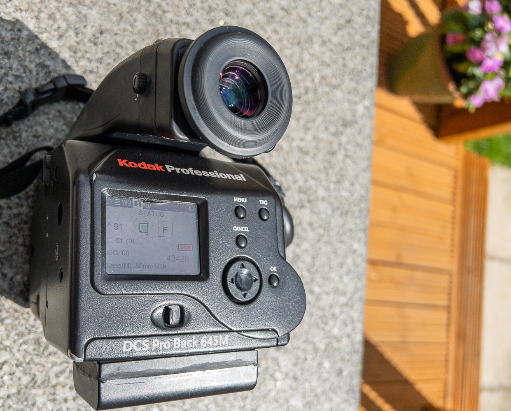

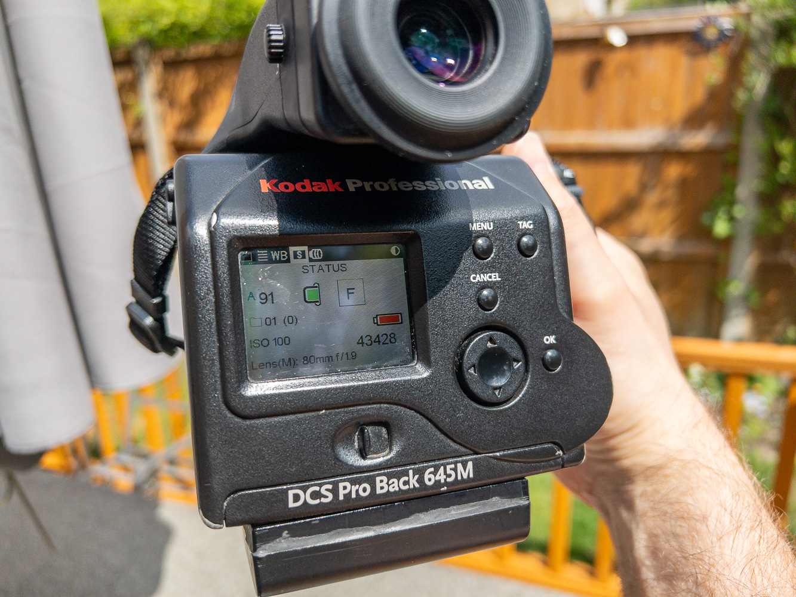

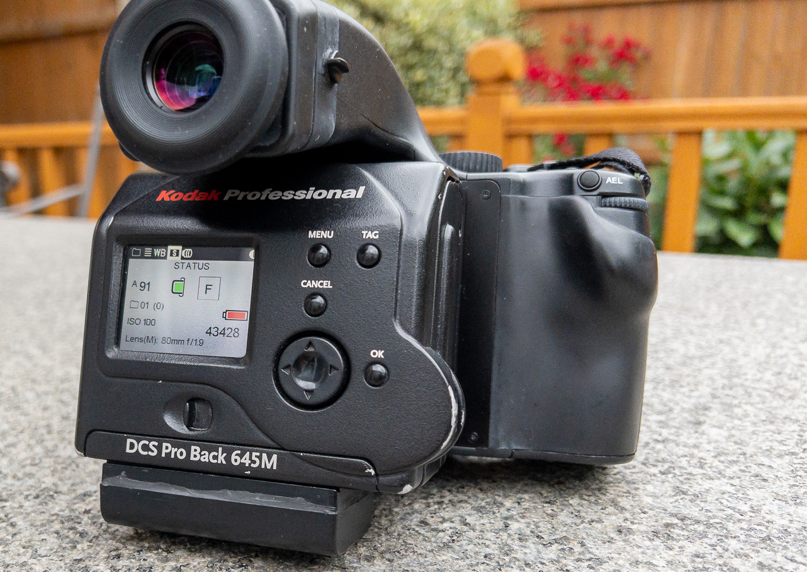

## Project history

This project followed the footsteps of something similar already done [here (link in russian)](https://web.archive.org/web/20171017015512/http://wowcamera.info/viewtopic.php?f=18&t=815&sid=7ef8761ab0095eecd0e935a0096e5fdd&start=740) but does a properly designed LED light source with constant current control.

I have designed the LED boards originally for 3x SMD LEDs in 2835 packages to fit perefecly inside LCD outer casing instead of CCFL. However upon experimenting with that it appears that Sanyo LCD backlight construction uses a light guide plate with straight vertical pattern that may work with linear light source like CCFL tube but does not work well with just a few LEDs creating long vertical beams of light. Modern LCD light guide panels use diaginal pattern that scatter light more evenly. With this in mind I also designed board for 6x SMD LEDs more closely spaced - those will need to be driven at 30mA to have the same power usage and light output as the 3x LEDs.

The alternative to 6x LED board and direct replacement is to place 3x LED lights sideways to the edge of the light guide - that means the light source needs to be behind the LCD case and holes for the LEDs need to be drilled into metallic frame to allow this ([similar to this](https://web.archive.org/web/20171021101310if_/http://wowcamera.info/download/file.php?id=11161&sid=97ba8f0b739cfa263edd7aab8cd7707e) used in approach from the russian project linked above). I will test both constructs and publish the results here. The latter approach is more involved than simple drop-in light replacement as this whole LED boards were designed to be but may be better at providing more uniform lighting.

The LED driver board provides constant current source from 3.3V and can be adjusted for your LEDs (by calculating R2 values for your LEDs current - see note on schematic with a few sample values). The LED driver board is very small and is designed to fit onto free space on ProBack board close to LCD and power source.

Current design was tested with Yuji LEDs [YJ-BC-2835L](https://www.yujiintl.com/bc-2835l-0-2w/) (20 lumens per LED - CRI95).

This is assembled driver and LED light source for 3x LEDs designed to go behind LCD frame:

This is assembled driver and LED light source look for 6x LEDs designed to go in place as direct replacement of CCFFL tube:

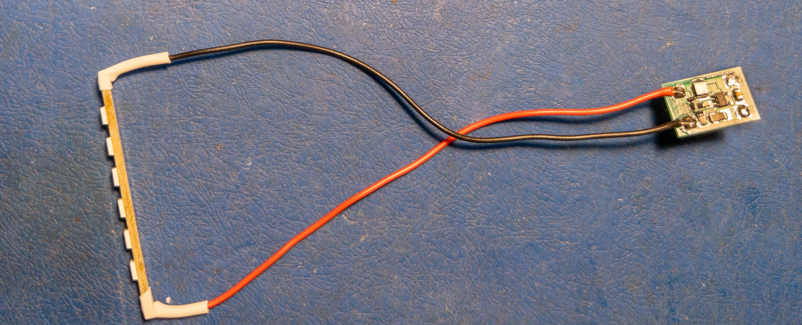

And this is 6x LED light source installed in place of CCFL and powered with LCD off - this shows drawback of this type of lighting caused by the linear structure of light guide panel. It could be addressed by sorcing the replacement for light guide panel with diagonal etching pattern but I have not managed to source any just yet.

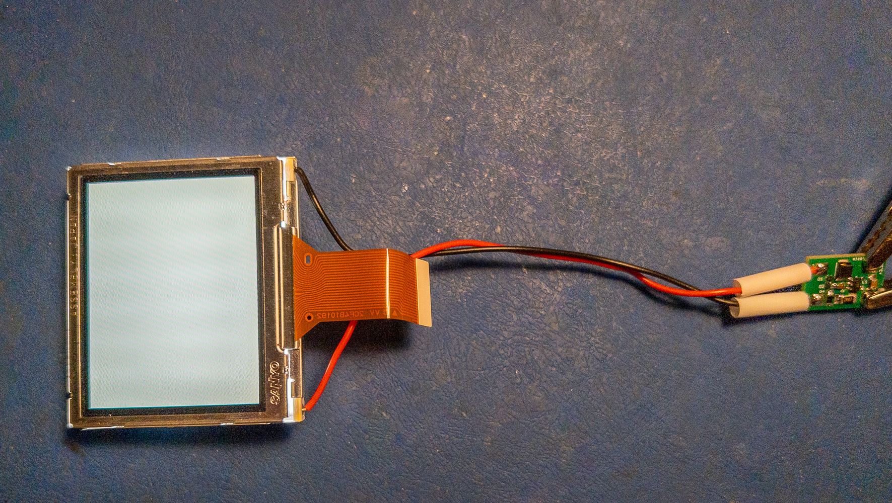

Even with the visible backlight pattern, this is far easier to install since it is essentially taking CCFL tunbe out and placing LED strip instead there and requires no drilling and no modifications of LCD frame. The brightness here on photo was reduced in postprocessing to show the pattern - in reality the backlight is much brighter.

For the Yuji LEDs above, the board in examples uses regulated LED current of 35mA with for string of 6 LEDs produces voltage of 17V (slightly less but that is highly dependent on LED variations). This gives overall consumption of 595mW which is still slightly less than original CCFL light 600mW yet substantially brighter.

This is how it looks all connected and lit:
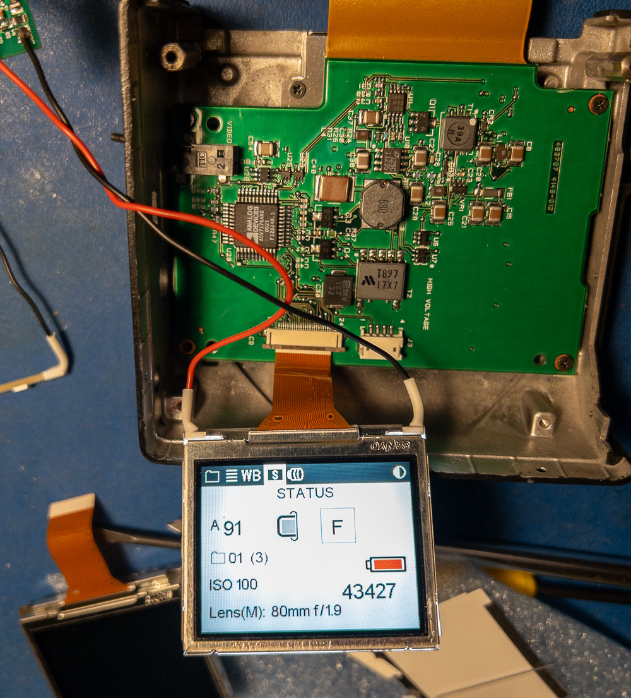

## LCD disassembly and light replacement

LCD assembly in a metal frame is a sandwich consisting of LCD panel itself (1), light boosting sheet of material under it (2), then diffusion sheet of material (3), then light guide acrylic panel (4) with white reflective material behind it and CCFL tube on one of the sides. All of that is packed within a metal frame.

It is relatively straightforward to take apart - LCD panel could be pried apart from the frame via side slots with a small screwdriver. This is how it looks when it is taken away:

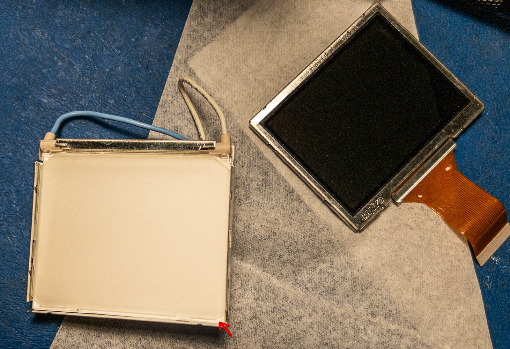

Take a note of the corner pointed to by red arrow - the light boosting sheet and diffusing sheet have one rounded corner that goes in only one way in the right bottom corner of the LCD assembly. Next, gently take away light boosting sheet (it has metal sheen on one side):

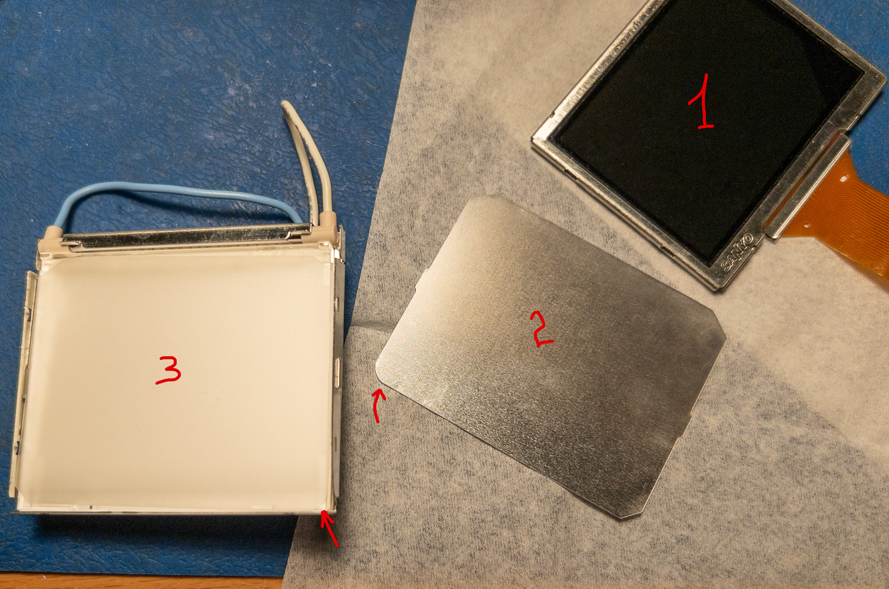

Then, gently take away diffusion sheet, again noting round corner and where it should go:

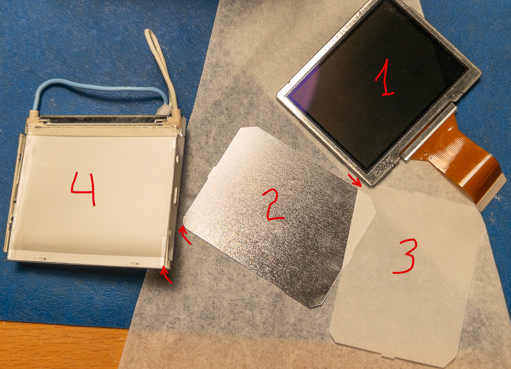

All the components here are numbered with their order in the assembly from the top starting with LCD panel. Lastly, take the light guide assembly from the frame, peel off the CCFL tube with the little sleave holding it and discard.

Next, push the LCD light board into the metal frame (it should be pretty tight) as far as it can go:

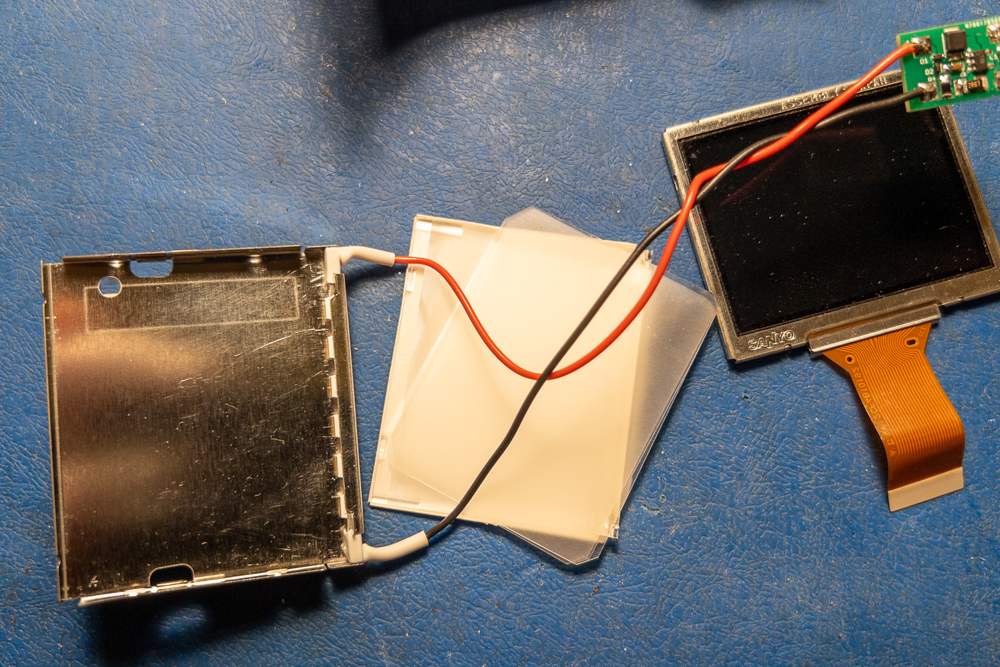

After that, place all the components back in reverse order: light guide panel (4), then diffusion sheet (3) noting round corner position, then light boosting sheet (2) noting round corner position and at last place and click LCD panel (1) into place. The LCD assembly is now complete.

## Board attachment

The LED driver board is designed to go on the empty space of the last board connecting to LCD - that sits directly behind CF card slot in the assembled position. Solder two short insulated wires to LED driver board, postion it close to C15 and C21 capacitors and solder ground and + wires as shown on this photo:

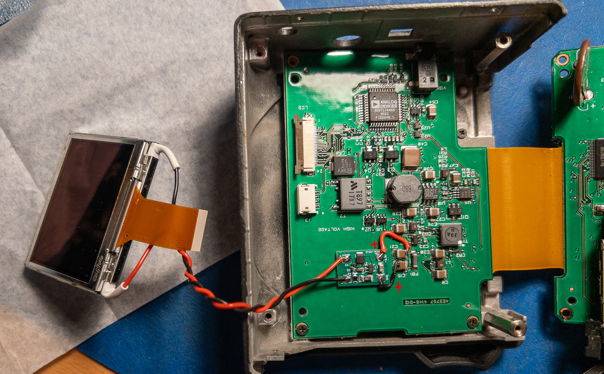

Both C15 and C21 are connected in parallel so it really does not matter which one of them wires soldered to but the sides of them: top one for GND and lower side for +3.3V. When soldered, plug in ProBack battery briefly to check backlight working. Then glue the LED driver board to the ProBack board. I used Sugru to attach the board to the main board and insulate the contacts:

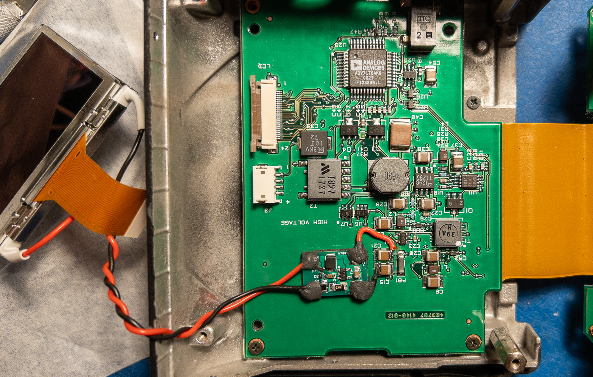

Then attach the LCD connector and put the LCD in place with the ProBack board on top. For added safety, loosely cover LED driver board by Capton tape:

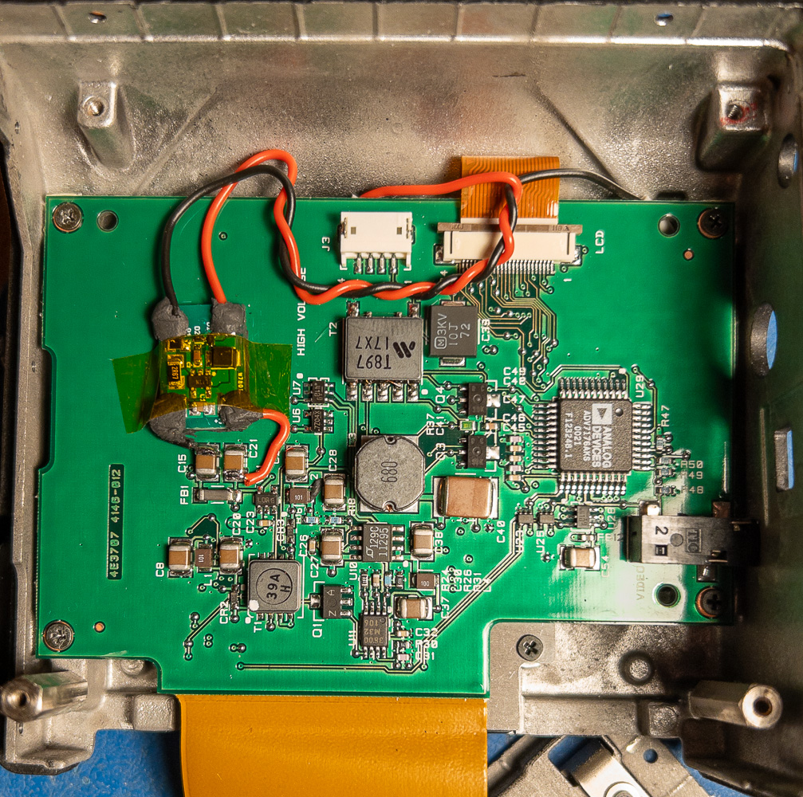

Then assemble the ProBack and test it on camera in the field.

