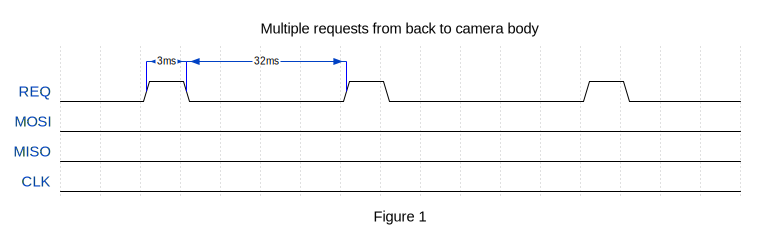
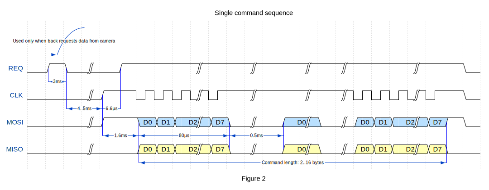
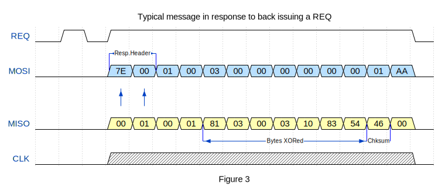
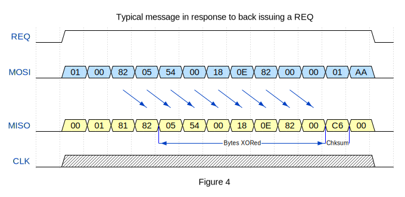
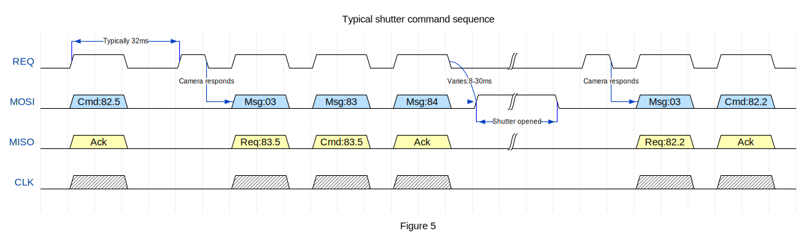

# Mamiya / Phase One Camera/Digital back communication protocol

## Licensing
This document is released under GNU Free Documentation License (GFDL).

## Preface
This protocol was reverse-engineered by me (with no help from Mamiya/Phase One whatsoever) in the process of adapting Kodak ProBack 645M digital back firmware to work with newer Mamiya/Phase One 645 DF/DF+ cameras. I have not had any help from either Mamiya or Phase One and therefore no proprietary information was used in this process other than that obtained by reverse-engineering communications and Kodak ProBack firmware. Reversed Kodak ProBack 645M code implementing all Mamiya communications [is available here](../Firmwares/ProBack645/3.4.2MH/Mamiya_patched.c).

All written in this article is applicable to the Mamiya / Phase One 645 medium format cameras. The full list of cameras ordered from oldest to more recent:
Mamiya 645 AF, Mamiya 645 AFD, Mamiya 645 AFD II, Mamiya 645 AFDIII/Phase One 645 AF, Mamiya 645 DF/Phase One 645 DF, Mamiya 645 DF+/Phase One 645 DF+.

This may or may not be applicable to new Phase One 645 XF - I have no means to test this.

## Introduction
Mamiya/Phase One camera-back communication protocol is essentially SPI protocol with a few quirks around initiating communication from either side. In all communications camera is SPI master and back is an SPI slave. The logic is 5V based.

The older version of this protocol is also used between older Mamiya 645 AF/AFD cameras and film backs but this is not supported by Phase One 645 cameras starting from 645 DF and therefore is not covered by this document. The differences will be briefly touched later on.

**Note:** all message content and byte values in this document are specified in hexadecimal format.

Abbreviations used throughout the text:

* **DB** - digital back
* **FB** - film back
* **DB REQ** - digital back issuing REQ signal to make camera start communication session

## The camera pinout
Looking at the camera rear the pins are

```
   Pin:    1    2    3    4    5    6    7    8
   Name:   NC   GND  REQ  SCK  SI   SO   VDD  NC
```
Where:

* VC - camera logic supply, VC to GND is +5V
* GND - ground
* REQ - SPI select, non-standard, see below, inactive low
* SCK - SPI CLK (clock) signal
* SI - SPI MOSI, camera to back data
* SO - SPI MISO, back to camera data

## SPI communication and parameters

In all SPI communications camera is master and DB is a slave. When communications are off (in inactive state) all pins are pulled down (to GND).

The following configuration of the SPI is used:

- CPOL=1 - clock is high when inactive
- CPHA=1 - data is valid on clock trailing edge
- LSB first, 8 bits per transfer
- SPI select is active high

Communication session can be initiated from either camera or DB.

When the camera initiates SPI communication session, it pulls up CLK and MOSI, and after a delay it pulls REQ high and holds it. This could be seen on Figure 2. MOSI is also pulled up (to VDD) when shutter is opened and camera is exposing - no communication is possible during that period. This could be seen on Figure 4 depicting typical shutter triggering message sequence.

When DB needs to initiate communication session, it does so by setting REQ high briefly (for 3ms). This requests the camera to initiate communication session in a standard way as described above (throughout this text it will be referred to as DB REQ). If camera does not respond to DB request, the back keeps repeating its requests by raising REQ high and waiting for response. The interval between requests from the back could be up to 200ms on Mamiya 645 AF, AFD and AFDII and up to 40ms on newer Mamiya/Phase one cameras. Phase One P*nn* backs use 32ms which works well across different camera models. The timings for REQ and waiting intervals are given on Figure 1 below:




## The SPI session

In a communication session camera sends a series of bytes to the back and optionally receives the same amount of bytes back. These series of bytes sent by the camera in a single communication session constitute a message and replies from the DB constitute a reply message. The overall timings and structure of the session sending a message and receiving a reply could be seen below (showing optional request from the back):



Not all messages require a reply from the back - for those that don't MISO simply kept low during session which indicates 0 for all data sent to the camera. 

The messages could be divided into the following categories:

* Notification - this category contains single message type that indicates camera being on/off (this includes going to sleep and waking up). It does not need a reply from the DB. 
* Commands from the camera - these messages pass on command from camera to back to indicate or set certain values. All of them need simultaneous reply (via SPI MISO) echoing command back. Some commands can require DB to do some processing and issue a request to camera as a follow up.
* Commands to the camera - these messages pass on command from DB to camera to indicate or set certain values. The communication here is done in two steps and initiated from the DB: following DB REQ, camera acknowledges and sends a request message asking what command DB wants to send, and after that issues a message for that command for back to fill in a reply. The data for the command passed to the camera on a a simultaneous reply for that command (via SPI MISO).
* Requests for data in replies - these messages indicate that camera expects DB to send certain data in simultaneous reply. A typical message of this kind is what camera responds to when back issues a request for communication - figuratively speaking, camera is asking DB "what's up" and back fills in the reply.

All messages are varying in size (1 to 16 bytes)- the size is determined by message content. For commands and requests the message end is indicated by AA value in last byte received from the camera and the standard message size is 8 bytes. 

When message is sent from camera as a result of DB REQ, it has preceding header with `7E 00` bytes (indicating that camera acknowledged DB request). The rest of the message follows standard command/request format. The simultaneous reply from the DB should have `00 01` correspondingly for these two header bytes.

On simultaneous reply sent back via MISO the byte before last is a checksum - all bytes in the command reply message sent out (excluding acknowledgement header) starting with third byte XORed together.



## DB protocol messages
This section lists all the messages and their formats used by the DB and camera communications. Messages are specified by their ID (see below) or first byte (for notification message).

### Notification message (message 7D)
On Mamiya 645 AF/AFD this is one byte message. Starting with Mamiya 645 AFD II this is two bytes message. The DB does not send a reply for this message.

| Function\Byte Num. |  0   |  1   | Comment 
| -------------------|:----:|:----:|------------------------------------
| Camera asleep/off  | `7D` |  n/a | Only on Mamiya 645 AF and AFD
| Camera asleep/off  | `7D` | `81` | Only on Mamiya 645 AFD II and newer
| Camera awake/on    | `7D` | `82` | Only on Mamiya 645 AFD II and newer

Where message indicates camera is asleep or being off, the exact state of the main switch should be checked to determine real state of the camera. The physical state of the main switch is supplied by one of the commands for message ID 81 when it changes and always prior to camera sending this message. This way DB can detect the real off state and shutdown or enter power saving mode.

### The message structure for all other messages
With exception of the camera on/off message above, all other messages have the following structure (excluding request ack header `7E 00` as described in the SPI session section above). The first message byte can be 02 for film bodies - those messages are intended for FB, they do not need reply and are not considered in this document.

| Byte Num.  |  0   |  1   |    2   |    3   | ...  |_\<LEN>_+7|_\<LEN>_+8|
|------------|:----:|:----:|:------:|:------:|:----:|:--------:|:--------:|
| **Message**| `01` | `00` |_\<MID>_|_\<LEN>_| ...  | _\<SV>_  |   `AA`   |
| **Reply**  | `00` | `01` |  `81`  |_\<MID>_| ...  | _\<CSM>_ |   `00`   |

Where:

* _\<MID>_ is a message identifier. For DB valid values are: 03, 81, 82, 83 and 84. FB messages use A0, A2, A3, A7 and A8 but these should be ignored by DB.
* _\<LEN>_ is optional extra length of message in bytes above standard 8 bytes. This should be added to 8 to get full message size It can also be supplied in replies.
* _\<SV>_ is `00` for Mamiya 645 AF/AFD and `01` for all other (newer) cameras
* _\<CSM>_=Byte(2) XOR Byte(3) ... XOR Byte(N-2) is a checksum of corresponding reply bytes-

The rest of the message content varies for each message ID and will be considered in separate sections below. All of the subsequent sections will list the message contents from message ID byte only to shorten data listed.

**Note**: FB on older Mamiya 645 AF/AFD cameras have their own message IDs as specified above. The FB messages are not overlapping with DB messages - they are entirely separate. DB working with older Mamiya 645 AF/AFD cameras simply has to ignore all non digital messages sent by the camera.

### Message ID 81 - wake up and initial ISO request

This message is usually sent by camera after turning on (following `7D 82` message) once and normally is not sent on the session later on. The extra length for this message is 2 (byte 5 of the reply). Note that byte 5 of the reply is a _\<LEN>_ - this is applicable to all messages where reply is required to be filled in by DB.

| Byte Num.  |  2   |  3   |  4   |  5   |    6   |  7   |    8   |  9   |
|------------|:----:|:----:|:----:|:----:|:------:|:----:|:------:|:----:|
| **Message**| `81` | `00` | `00` | `00` |  `00`  | `00` |_\<SV>_ | `AA` |
| **Reply**  | `81` | `81` | `00` | `02` |_\<ISO>_| `01` |_\<CSM>_| `00` |


Where _\<ISO>_ encodes ISO set by DB as follows:

| _\<ISO>_|  ISO value
|:-------:|-----------
| `96`    | 25
| `97`    | 32
| `95`    | 40
| `94`    | 50
| `9C`    | 64
| `9D`    | 80
| `9F`    | 100
| `9E`    | 125
| `9A`    | 160
| `9B`    | 200
| `99`    | 250
| `98`    | 320
| `88`    | 400
| `89`    | 500
| `8B`    | 640
| `8A`    | 800
| `8E`    | 1000
| `8F`    | 1250
| `8D`    | 1600
| `8C`    | 2000
| `84`    | 2500
| `85`    | 3200
| `87`    | 4000
| `86`    | 5000
| `82`    | 6400

**Note:** ISO encoding here does not match the ISO data code used in commands below. I can't say why this is the case, but I would guess that perhaps it is because this message existed prior to digital version of this protocol in earlier cameras supporting only film backs.

### Command message exchange

The rest of the messages are commands. They follow specific message exchange sequences. The command can be sent by a camera, or it can be requested by DB using DB REQ. 

The commands _from_ and _to_ camera pass a number of settings on a message. Each command is identified by a number - overall there are 5 commands that I could reverse engineer. The same number means the same command for both _from_ and _to_ camera commands (but the _from_ and _to_ versions may have different number of settings). All commands use the same format of command ID byte (_\<CID>_) defined as follows:

* _\<CID>_ is a byte where upper nibble encodes command number (1..5) and lower nibble encodes maximum number of one byte settings used by command (_from_ or _to_) in the following bytes of the message. This implies that _\<LEN>_ = number of settings + 1. An example: command 1 has 3 settings so its _\<CID>_ is 13.

If DB requests a command, it can be either command from camera or its counterpart from DB to the camera. When camera sends a command to the DB, it expects a follow up: DB has to process is, request and send the same command to the camera. This effectively results in the following message sequence: message 82 (command from the camera), DB REQ, message 03 (request), message 83 (command to the camera). 

In this message exchange the DB REQ is expected within certain interval and the behaviour differs across the cameras if it is not received. Older Mamiya 645 AF/AFD/AFD II tolerate longer delays and simply set No DB error on camera if DB does not reply. Newer cameras Mamiya/Phase One 645 DF/DF+ have much shorter interval tolerances and behave differently - failing to receive DB REQ within required interval places camera into undefined state: mirror is up, shutter is closed and camera fails to respond to any communications (the only remedy is to take off an re-insert camera battery). The Phase One Pxx DB use 32ms interval from the start of message 82 (command from the camera) on all Mamiya/Phase One 645 cameras - this seems to work well on older an newer cameras. The 200ms interval was used by Kodak ProBack 645M originally and this only worked on older Mamiya cameras.

The list of existing commands by command number:

1. This command is sent from camera when camera state changes. This happens for example when shutter button half pressed, or lens replaced, or camera mode has changed etc. The DB can request to send this command to the camera when it is woken up.
2. This command is requested by DB after the shot was taken by the camera and shutter closed to get the shot metadata (camera mode, exposure correction, aperture, focal length and shutter speed). The DB sends the DB status in this command to indicate its state (that it is busy writing to the card for example). Camera will wait for this command requested by DB after ths shutter closes and is blocked for the wait period. The wait period is different for different camera models: Mamiya 645 AFD/AFDII waits for more than 30 seconds, Mamiya/Phase One 645 DF/DF+ will only wait for 10 sec. After waiting if no DB request comes, camera unblocks and is ready to take another shot.
3. This command is requested by the DB to get and then set camera settings such as camera mode, exposure correction, aperture and shutter speed. It can be used to control camera settings electronically from the DB or remote control software.
4. This command has no usable from camera counterpart. It is only requested by DB to send request start shot sequence to camera or cancel previously pending request to a camera. It is used to initiate shooting from the DB.
5. This is the message sent by camera just prior to triggering shutter (shutter early warning). It indicates exposure parameters and duration of the shot to the DB.

### Message ID 82 - command from the camera to DB

This message sends one of the commands from camera to DB. 

The reply from the DB for all commands from the camera simply reflects the command content DB (with one byte delay starting with third byte of the message/fourth byte of reply).



Format of the incoming command messages

| Command\Byte Num.      |  2   |  3   |4(_\<CID>_)|   5   |   6   |   7   |   8   |   9   |   10  |  11   |  12   |   13  |  14   |
|------------------------|:----:|:----:|:----:|:-----:|:-----:|:-----:|:-----:|:-----:|:-----:|:-----:|:-----:|:-----:|:-----:|
|Camera state changed    | `82` | `04` | `13` |_\<ST>_|_\<CI>_|_\<MD>_|  `00` |  `00` |_\<SV>_|  `AA` |       |       |       |
|Post-shot data exchange | `82` | `07` | `26` |_\<ST>_|_\<AV>_|_\<TV>_|_\<CV>_|_\<L1>_|_\<L0>_|  `00` |  `00` |_\<SV>_|  `AA` |
|Get/set camera settings | `82` | `06` | `35` |_\<ST>_|_\<MD>_|_\<AV>_|_\<TV>_|_\<CV>_|  `00` |  `00` |_\<SV>_|  `AA` |       |
|DB request to camera    | `82` | `03` | `42` |_\<ST>_|  `00` |  `00` |  `00` |_\<SV>_|  `AA` |       |       |       |       |
|Shutter early warning   | `82` | `05` | `54` |_\<ST>_|_\<AV>_|_\<SU>_|_\<SL>_|  `00` |  `00` |_\<SV>_|  `AA` |       |       |

Where:

* _\<ST>_ - received state. In camera state change (_\<CID>_=`13`) command _\<ST>_==5 indicates camera main switch off.
* _\<CI>_ - unknown purpose. Does not seem needed by the DB.
* _\<MD>_ - encodes currently selected camera mode value (see detailed set of codes in data codes section below)
* _\<AV>_ - encodes currently selected aperture value (see detailed set of codes in data codes section below)
* _\<TV>_ - encodes currently selected shutter speed value (see detailed set of codes in data codes section below)
* _\<CV>_ - encodes currently selected exposure compensation value (see detailed set of codes in data codes section below)
* _\<L1>_,_\<L0>_ - upper and lower byte of selected lens focal length. The focal length calculated as `FL(mm) = (<L1> & 7) << 8 | <L0>`
* _\<SU>_,_\<SL>_ - shutter speed value prior to exposure in seconds. It is a fractional number where _\<SU>_ is an integer mantissa and _\<SL>_ is decimal exponent  (the 8th bit encodes sign and is 1 for negative). From my experiments exponent is always negative if supplied. Considering this, the overall value in seconds can be calculated as `Shutter(sec) = (float)<SU> / pow(10, <SL> & 0x7F)` 


### Message ID 83 - command from the DB to the camera

This message sends one of the commands from DB to camera. The message itself is empty (filled with `00`) and the command is populated on the reply. The generic format id as follows:

| Byte Num.  |  2   |  3   |  4   |    5   |    6   |  ...  |   N-1  |  N   |
|------------|:----:|:----:|:----:|:------:|:------:|:-----:|:------:|:----:|
| **Message**| `83` | `00` | `00` |  `00`  |  `00`  |  ...  |_\<SV>_ | `AA` |
| **Reply**  | `81` | `83` | `00` |_\<LEN>_|_\<CID>_|  ...  |_\<CSM>_| `00` |

Format of all command replies:

| Command\Byte Num.      |  5   |6(_\<CID>_)|   7   |    8   |   9    |   10   |   11   |   12   |   13   |  14   |
|------------------------|:----:|:----:|:-----:|:------:|:------:|:------:|:------:|:------:|:------:|:-----:|
|Camera state changed    | `04` | `13` |_\<ST>_|_\<ISO>_|_\<EO>_ |_\<CSM>_|  `00`  |        |        |       |
|Post-shot data exchange | `07` | `26` |_\<ST>_|_\<EW>_ |_\<P1>_ |  `00`  |  `00`  |  `00`  |_\<CSM>_|  `00` |
|Get/set camera settings | `06` | `35` |_\<ST>_|_\<MD>_ |_\<AV>_ |_\<TV>_ |_\<CV>_ |_\<CSM>_|  `00`  |       |
|DB request to camera    | `03` | `42` |_\<ST>_|_\<RE>_ |_\<CSM>_|  `00`  |        |        |        |       |
|Shutter early warning   | `05` | `54` |_\<ST>_|  `00`  |  `00`  |  `00`  |_\<CSM>_|  `00`  |        |       |

Where:

* _\<ISO>_ encodes currently selected by DB ISO value (see detailed set of codes in data codes section below). 
* _\<RE>_ - request to initiate shooting or clear previous request to the camera. The following values could be set on appropriate command:
    * `00` - clears ongoing previously issued request
    * `03` - request camera to take a shot (software shutter press)
    * `01` - request to wake up the camera and meter/focus but not taking a shot (software shutter half press)
* _\<EO>_, _\<EW>_, _\<P1>_ - unknown purpose (does not seem needed by the DB). Kodak ProBack 645M originally set all three to `00` and Phase One Pxx DB sets _\<EO>_=`90`, _\<EW>_=`00` and _\<P1>_=`99`
* _\<MD>_ - encodes currently selected by DB mode value (see detailed set of codes in data codes section below)
* _\<AV>_ - encodes currently selected by DB aperture value (see detailed set of codes in data codes section below)
* _\<TV>_ - encodes currently selected by DB shutter speed value (see detailed set of codes in data codes section below)
* _\<CV>_ - encodes currently selected by DB exposure compensation value (see detailed set of codes in data codes section below)
* _\<ST>_ - state of DB and operating mode sent to camera. Upper nibble (bits 8..15) indicates shutter operating mode and lower nibble (bits 0..7) indicates DB state. See details below.

**Shutter mode values**

* 0 - standard mode, no delays after shutter open message. This mode was used by Kodak ProBack 645M originally
* 2 - standard mode, no delays after shutter open message. This mode is used by Phase One Pxx DB in "Short Shutter Latency" mode
* 5 - delayed mode, around 350-400ms delay after shutter open message before really opening shutter. This mode is used by Phase One Pxx DB in "Long Shutter Latency" mode

The first two modes allow faster shooting but require DB to keep CCD sensor active. The usual tactics in these modes is for DB to activate sensor on one of the earlier camera messages. The last mode allows enough time to activate and flush the sensor before shutter opening but its drawback is a substantial blackout.

**DB State values**

States other than 0 prevent camera from shooting - the camera simply awaits for DB to report the ready state.

* 0 - DB is on and ready for shooting
* 1 - other error (DB is not available)
* 3 - no memory, card is full or missing (Mem DB message on the camera)
* 5 - battery low (Batt DB message on the camera)
* 8 - DB is busy processing (Busy DB message on the camera). Can be used to prevent camera from operating whilst processing the previously taken shot


### Message ID 03 - request from the camera following DB REQ

This message gets issued by camera in response to DB REQ. DB then fills in the reply indicating what message command it requests camera to do. This could be either command from camera to DB (message 82) or command from DB to camera (message 83). Note that byte 5 of the reply is a _\<LEN>_ - this is applicable to all messages where reply is required to be filled in by DB.

Message format:

| Byte Num.  |  2   |  3   |  4   |  5   |  6   |   7    |   8    |   9    |  10  |
|------------|:----:|:----:|:----:|:----:|:----:|:------:|:------:|:------:|:----:|
| **Message**| `03` | `00` | `00` | `00` | `00` |  `00`  |  `00`  |_\<SV>_ | `AA` |
| **Reply**  | `81` | `03` | `00` | `03` | `10` |_\<MID>_|_\<CID>_|_\<CSM>_| `00` |

Where:

* _\<MID>_ is a message ID of the message command being requested. Could be either 82 or 83
* _\<CID>_ is a command ID byte of the command being requested (format of this defined earlier). For 82 messages the lower nibble (number of settings) is not needed and can be 0 (sending a full _\<CID>_ for both message IDs however is ok).

### Message ID 84 - shutter open

This message is sent as a last message before shutter opening. After this message camera pulls all pins low and pulls MOSI pin high for the duration of the shutter opening (this is longer than exposure time since it includes mirror up and other camera internal processing).

Message format:

| Byte Num.  |  2   |  3   |  4   |  5   |   6    |   7  |
|------------|:----:|:----:|:----:|:----:|:------:|:----:|
| **Message**| `84` | `00` | `00` | `00` |_\<SV>_ | `AA` |
| **Reply**  | `81` | `84` | `00` | `00` |_\<CSM>_| `00` |

This message is always preceded by shutter early warning command (message 82 command 5). After the camera stopped taking exposure and lowered MOSI pin, the DB is expected to issue post-shot data command (message 82 command 2). The overall sequence of messages can be seen in diagram below:



## Data codes used in commands to/from camera

### ISO encodings

| _\<ISO>_|  ISO value
|:-------:|-----------
| `90` | 25 |
| `92` | 32 |
| `8E` | 40 |
| `88` | 50 |
| `8A` | 64 |
| `06` | 80 |
| `00` | 100 |
| `02` | 125 |
| `0E` | 160 |
| `08` | 200 |
| `0A` | 250 |
| `16` | 320 |
| `10` | 400 |
| `12` | 500 |
| `1E` | 640 |
| `18` | 800 |
| `1A` | 1000 |
| `16` | 1250 |
| `20` | 1600 |
| `22` | 2000 |
| `2E` | 2500 |
| `28` | 3200 |
| `2A` | 4000 |
| `26` | 5000 |
| `30` | 6400 |

### Camera Mode encodings

|_\<MD>_| Mode value
|:-----:|-----------
| `10`  | Program AE (P)
| `04`  |  Shutter priority AE (Tv)
| `08`  |  Aperture priority AE (Av)
| `02`  |  Manual (M)
| `01`  |  Flash sync (X)
| `00`  |  Time exposure (T)

### Aperture encodings

|_\<AV>_|  Aperture
|:-----:|-----------
| `00`  | f1.0 |
| `03`  | f1.2 |
| `08`  | f1.4 |
| `0B`  | f1.7 |
| `10`  | f2.0 |
| `13`  | f2.4 |
| `18`  | f2.8 |
| `1A`  | f3.2 |
| `1B`  | f3.4 |
| `26`  | f3.5 |
| `20`  | f4.0 |
| `22`  | f4.5 |
| `23`  | f4.8 |
| `2E`  | f5.0 |
| `28`  | f5.6 |
| `2A`  | f6.3 |
| `2B`  | f6.8 |
| `36`  | f7.1 |
| `30`  | f8.0 |
| `32`  | f9.0 |
| `33`  | f9.5 |
| `3E`  | f10 |
| `38`  | f11 |
| `3A`  | f12 |
| `3B`  | f13 |
| `46`  | f14 |
| `40`  | f16 |
| `42`  | f18 |
| `43`  | f19 |
| `4E`  | f20 |
| `48`  | f22 |
| `4B`  | f27 |
| `50`  | f32 |
| `53`  | f38 |
| `58`  | f45 |
| `5B`  | f54 |
| `60`  | f64 |
| `63`  | f76 |
| `68`  | f90 |
| `F8`  | Manual/non electronic lens |

### Aperture conversion

Camera exposure meter have 1/8 stop granularity for apertures. The codes it return therefore for _\<AV>_ are in 1/8 stops. Most metadata recording and table above for _\<AV>_ is given for 1/2 and 1/3 steps so conversion is needed for camera sent _\<AV>_ value to round it up to nearest 1/2 or 1/3 value. This is what lookup table below is for. The table is 256 bytes and contains rounded up _\<AV>_ value for value supplied by camera (upper nibble is a row and lower nibble is a column for camera supplied _\<AV>_ value). For camera supplied _\<AV>_ values larger than `10` value `00` in this table means no mapping (the camera supplied _\<AV>_ should be used as is).

|     |  0   |  1   |  2   |  3   |  4   |  5   |  6   |  7   |  8   |  9   |  A   |  B   |  C   |  D   |  E   |  F   |
|:---:|:----:|:----:|:----:|:----:|:----:|:----:|:----:|:----:|:----:|:----:|:----:|:----:|:----:|:----:|:----:|:----:|
|**0**| `00` | `00` | `03` | `03` | `00` | `00` | `00` | `00` | `08` | `08` | `0B` | `0B` | `00` | `08` | `03` | `00` |
|**1**| `10` | `10` | `13` | `13` | `00` | `10` | `0B` | `00` | `18` | `18` | `1A` | `1B` | `00` | `18` | `13` | `00` |
|**2**| `20` | `20` | `22` | `23` | `00` | `20` | `26` | `00` | `28` | `28` | `2A` | `2B` | `00` | `28` | `2E` | `00` |
|**3**| `30` | `30` | `32` | `33` | `00` | `30` | `36` | `00` | `38` | `38` | `3A` | `3B` | `00` | `38` | `3E` | `00` |
|**4**| `40` | `40` | `42` | `43` | `00` | `40` | `46` | `00` | `48` | `48` | `4B` | `4B` | `00` | `48` | `4E` | `00` |
|**5**| `50` | `50` | `53` | `53` | `00` | `50` | `4B` | `00` | `58` | `58` | `5B` | `5B` | `00` | `58` | `53` | `00` |
|**6**| `60` | `60` | `63` | `63` | `00` | `60` | `5B` | `00` | `68` | `68` | `00` | `00` | `00` | `68` | `63` | `00` |
|**7**| `00` | `00` | `00` | `00` | `00` | `00` | `00` | `00` | `00` | `00` | `00` | `00` | `00` | `00` | `00` | `00` |
|**8**| `00` | `00` | `00` | `00` | `00` | `00` | `00` | `00` | `00` | `00` | `00` | `00` | `00` | `00` | `00` | `00` |
|**9**| `00` | `00` | `00` | `00` | `00` | `00` | `00` | `00` | `00` | `00` | `00` | `00` | `00` | `00` | `00` | `00` |
|**A**| `00` | `00` | `00` | `00` | `00` | `00` | `00` | `00` | `00` | `00` | `00` | `00` | `00` | `00` | `00` | `00` |
|**B**| `00` | `00` | `00` | `00` | `00` | `00` | `00` | `00` | `00` | `00` | `00` | `00` | `00` | `00` | `00` | `00` |
|**C**| `00` | `00` | `00` | `00` | `00` | `00` | `00` | `00` | `00` | `00` | `00` | `00` | `00` | `00` | `00` | `00` |
|**D**| `00` | `00` | `00` | `00` | `00` | `00` | `00` | `00` | `00` | `00` | `00` | `00` | `00` | `00` | `00` | `00` |
|**E**| `00` | `00` | `00` | `00` | `00` | `00` | `00` | `00` | `00` | `00` | `00` | `00` | `00` | `00` | `00` | `00` |
|**F**| `00` | `00` | `00` | `00` | `00` | `00` | `00` | `00` | `F8` | `00` | `00` | `00` | `00` | `00` | `00` | `00` |


### Shutter speed encodings

|_\<TV>_| Shutter speed
|:-----:|--------------
| `A8`  | 30 " |
| `AA`  | 25 " |
| `A7`  | 20 " |
| `A6`  | 20 " |
| `A0`  | 15 " |
| `A2`  | 13 " |
| `9F`  | 10 " |
| `9E`  | 10 " |
| `98`  | 8 " |
| `9A`  | 6 " |
| `97`  | 6 " |
| `96`  | 5 " |
| `90`  | 4 " |
| `92`  | 3 " |
| `8F`  | 3 " |
| `8E`  | 2.5 " |
| `88`  | 2 " |
| `8A`  | 1.6 " |
| `07`  | 1.5 " |
| `06`  | 1.3 " |
| `00`  | 1.0 " |
| `02`  | 0.8 " |
| `03`  | 0.7 " |
| `0E`  | 0.6 " |
| `08`  | 1/2 |
| `0A`  | 1/2.5 |
| `0B`  | 1/3 |
| `16`  | 1/3 |
| `10`  | 1/4 |
| `12`  | 1/5 |
| `13`  | 1/6 |
| `1E`  | 1/6 |
| `18`  | 1/8 |
| `1A`  | 1/10 |
| `1B`  | 1/10 |
| `26`  | 1/13 |
| `20`  | 1/15 |
| `22`  | 1/20 |
| `23`  | 1/20 |
| `2E`  | 1/25 |
| `28`  | 1/30 |
| `2A`  | 1/40 |
| `2B`  | 1/45 |
| `36`  | 1/50 |
| `30`  | 1/60 |
| `32`  | 1/80 |
| `33`  | 1/90 |
| `3E`  | 1/100 |
| `38`  | 1/125 |
| `3A`  | 1/160 |
| `3B`  | 1/180 |
| `46`  | 1/200 |
| `40`  | 1/250 |
| `42`  | 1/320 |
| `43`  | 1/350 |
| `4E`  | 1/400 |
| `48`  | 1/500 |
| `4A`  | 1/640 |
| `4B`  | 1/700 |
| `56`  | 1/800 |
| `50`  | 1/1000 |
| `52`  | 1/1250 |
| `53`  | 1/1500 |
| `5E`  | 1/1600 |
| `58`  | 1/2000 |
| `5A`  | 1/2500 |
| `5B`  | 1/3000 |
| `66`  | 1/3200 |
| `60`  | 1/4000 |
| `F8`  | Bulb   |

### Shutter conversion

Camera exposure meter have 1/8 stop granularity for shutter speeds. The codes it return therefore for _\<TV>_ are in 1/8 stops. Most metadata recording and table above for _\<TV>_ is given for 1/2 and 1/3 steps so conversion is needed for camera sent _\<TV>_ value to round it up to nearest 1/2 or 1/3 value. This is what lookup table below is for. The table is 256 bytes and contains rounded up _\<TV>_ value for value supplied by camera (upper nibble is a row and lower nibble is a column for camera supplied _\<TV>_ value). For camera supplied _\<TV>_ values larger than `10` value `00` in this table means no mapping (the camera supplied _\<TV>_ should be used as is).

|     |  0   |  1   |  2   |  3   |  4   |  5   |  6   |  7   |  8   |  9   |  A   |  B   |  C   |  D   |  E   |  F   |
|:---:|:----:|:----:|:----:|:----:|:----:|:----:|:----:|:----:|:----:|:----:|:----:|:----:|:----:|:----:|:----:|:----:|
|**0**| `00` | `00` | `02` | `03` | `00` | `00` | `06` | `07` | `08` | `08` | `0A` | `0B` | `00` | `08` | `0E` | `00` |
|**1**| `10` | `10` | `12` | `13` | `00` | `10` | `16` | `00` | `18` | `18` | `1A` | `1B` | `00` | `18` | `1E` | `00` |
|**2**| `20` | `20` | `22` | `23` | `00` | `20` | `26` | `00` | `28` | `28` | `2A` | `2B` | `00` | `28` | `2E` | `00` |
|**3**| `30` | `30` | `32` | `33` | `00` | `30` | `36` | `00` | `38` | `38` | `3A` | `3B` | `00` | `38` | `3E` | `00` |
|**4**| `40` | `40` | `42` | `43` | `00` | `40` | `46` | `00` | `48` | `48` | `4A` | `4B` | `00` | `48` | `4E` | `00` |
|**5**| `50` | `50` | `52` | `53` | `00` | `50` | `56` | `00` | `58` | `58` | `5A` | `5B` | `00` | `58` | `5E` | `00` |
|**6**| `60` | `60` | `00` | `00` | `00` | `60` | `66` | `00` | `00` | `00` | `00` | `00` | `00` | `00` | `00` | `00` |
|**7**| `00` | `00` | `00` | `00` | `00` | `00` | `00` | `00` | `00` | `00` | `00` | `00` | `00` | `00` | `00` | `00` |
|**8**| `00` | `00` | `00` | `00` | `00` | `00` | `00` | `00` | `88` | `88` | `8A` | `8A` | `00` | `88` | `8E` | `8F` |
|**9**| `90` | `90` | `92` | `92` | `00` | `90` | `96` | `97` | `98` | `98` | `9A` | `9A` | `00` | `98` | `9E` | `9F` |
|**A**| `A0` | `A0` | `A2` | `A2` | `00` | `A0` | `A6` | `A7` | `A8` | `A8` | `AA` | `AA` | `00` | `00` | `00` | `00` |
|**B**| `00` | `00` | `00` | `00` | `00` | `00` | `00` | `00` | `00` | `00` | `00` | `00` | `00` | `00` | `00` | `00` |
|**C**| `00` | `00` | `00` | `00` | `00` | `00` | `00` | `00` | `00` | `00` | `00` | `00` | `00` | `00` | `00` | `00` |
|**D**| `00` | `00` | `00` | `00` | `00` | `00` | `00` | `00` | `00` | `00` | `00` | `00` | `00` | `00` | `00` | `00` |
|**E**| `00` | `00` | `00` | `00` | `00` | `00` | `00` | `00` | `00` | `00` | `00` | `00` | `00` | `00` | `00` | `00` |
|**F**| `00` | `00` | `00` | `00` | `00` | `00` | `00` | `00` | `F8` | `00` | `00` | `00` | `00` | `00` | `00` | `00` |


### Exposure compensation encodings

|_\<CV>_| Compensation value
|:-----:|-------------------
| `A8`  | -5.0 |
| `AA`  | -4.7 |
| `A6`  | -4.3 |
| `A0`  | -4.0 |
| `A2`  | -3.7 |
| `9E`  | -3.3 |
| `98`  | -3.0 |
| `9A`  | -2.7 |
| `96`  | -2.3 |
| `90`  | -2.0 |
| `92`  | -1.7 |
| `8E`  | -1.3 |
| `88`  | -1.0 |
| `8A`  | -0.7 |
| `06`  | -0.3 |
| `00`  |  0.0 |
| `02`  | +0.3 |
| `0E`  | +0.7 |
| `08`  | +1.0 |
| `0A`  | +1.3 |
| `16`  | +1.7 |
| `10`  | +2.0 |
| `12`  | +2.3 |
| `1E`  | +2.7 |
| `18`  | +3.0 |
| `1A`  | +3.3 |
| `26`  | +3.7 |
| `20`  | +4.0 |
| `22`  | +4.3 |
| `2E`  | +4.7 |
| `28`  | +5.0 |


## Example communication session

This is an example of message exchange captured for the following scenario: camera mode M, shutter speed 1/30,  aperture f/3.5, shutter half press followed by shutter full press and taking shot. All the message dumps here print time in ms passed from previous message start, followed by message from camera and reply from DB under it.

This exchange sequence [is also available here](data/shutter.logicdata) as signal capture done in [Saleae Logic](https://www.saleae.com/) analyzer and can be opened in their capture program.

Camera shutter button half pressed

```
0           01 00 82 04 13 00 09 02 00 00 01 AA
            00 01 81 82 04 13 00 09 02 00 1F 00
```
DB REQ issued.

```
38.77       7E 00 01 00 03 00 00 00 00 00 00 01 AA
            00 01 00 01 81 03 00 03 10 83 13 01 00
```

```
13.9        01 00 83 00 00 00 00 00 00 00 01 AA
            00 01 81 83 00 04 13 20 00 90 A5 00
```

Camera shutter button fully pressed - shutter early warning

```
1506.96     01 00 82 05 54 00 26 1F 83 00 00 01 AA
            00 01 81 82 05 54 00 26 1F 83 00 E8 00
```
DB REQ issued.

```
42.02       7E 00 01 00 03 00 00 00 00 00 00 01 AA
            00 01 00 01 81 03 00 03 10 83 54 46 00
```

```
15.12       01 00 83 00 00 00 00 00 00 00 00 01 AA
            00 01 81 83 00 05 54 20 00 00 00 73 00
```

Shutter open message

```
15.9        01 00 84 00 00 00 01 AA
            00 01 81 84 00 00 05 00
```
Shutter closed after MISO went down, DB REQ issued.

```
168.16      7E 00 01 00 03 00 00 00 00 00 00 01 AA
            00 01 00 01 81 03 00 03 10 82 20 33 00
```
Shot data received, DB status reported as busy

```
16.7        01 00 82 07 26 00 26 28 00 08 6E 00 00 01 AA
            00 01 81 82 07 26 00 26 28 00 08 6E 00 4A 00
```
DB REQ issued.

```
46.12       7E 00 01 00 03 00 00 00 00 00 00 01 AA
            00 01 00 01 81 03 00 03 10 83 26 34 00
```

```
13.48       01 00 83 00 00 00 00 00 00 00 00 00 00 01 AA
            00 01 81 83 00 07 26 28 00 99 00 00 00 92 00
```
DB finished processing capture, DB REQ issued.

```
1351.84     7E 00 01 00 03 00 00 00 00 00 00 01 AA
            00 01 00 01 81 03 00 03 10 82 10 03 00
```

```
13.47       01 00 82 04 13 00 09 02 00 00 01 AA
            00 01 81 82 04 13 00 09 02 00 1F 00
```
DB REQ issued.

```
39.18       7E 00 01 00 03 00 00 00 00 00 00 01 AA
            00 01 00 01 81 03 00 03 10 83 13 01 00
```
DB status set to ready.

```
13.88       01 00 83 00 00 00 00 00 00 00 01 AA
            00 01 81 83 00 04 13 20 00 90 A5 00
```

## Pseudocode handling communications with camera

```c++
    // variables
    lastCameraReqTime = 0
    requestCommand = 0
    requestMessage = 0

    byte msg03[] = {3, 3, 0x10, 0x82, 0}
    byte msg81[] = {0x81, 2, 0x9F, 1} 
    byte msg83[]  = {0x83, 0, 0, 0, 0, 0, 0, 0, 0, 0, 0}

    byte message[32]
    byte reply[32]

    // initialise hardware
    setup pins
    configure SPI
    disable MISO

    // loop forever
    while (1)
    {
        // Wait until camera sends something
        while (REQ is low or MOSI is low)
        {
            sleep 1ms 

            if (REQ is low and MOSI is low)
            {
                // check if we need to request
                if (requestCommand == 0)
                {
                    requestMessage, requestCommand  = get request command for current back state
                }
                
                if (requestCommand != 0 
                    and currentTime() - lastCameraReqTime > 32ms)
                {
                    set REQ high
                    wait 3ms
                    set REQ low
                    lastCameraReqTime = currentTime()
                }
            }
        }

        // we have the message from camera
        lastCameraReqTime = currentTime()
        
        // initialise data
        fill message with 0
        fill reply with 0

        sendReceiveSPIByte(message[0], reply[0])
        
        if (message[0] == 0x7E)
        {
            enable MISO

            // skip the header
            sendReceiveSPIByte(message[0], 1)
            sendReceiveSPIByte(message[0], 0)
        }
        
        if (message[0] == 1)
        {
            enable MISO
        }

        // set the reply data source
        byte* replyData = message 

        byte messageBytes = (message[0] == 0x7D) ? 2 : 8
        byte checkSum = 0
        byte curByte = 1
        
        while (REQ is high && curByte < messageBytes)
        {
            if (message[0] == 1)
            {
                reply[curByte] = *replyData

                if (curByte == 2)
                {
                    reply[curByte] = 0x81
                }
                else if (curByte == 4)
                {
                    messageBytes = message[3] + 8
                    if (message[2] == 3)
                    {
                        msg03[3] = requestMessage
                        msg03[4] = requestCommand
                        replyData = msg03
                        messageBytes = msg03[1] + 8
                        
                        if (requestMessage == 0x83)
                        {
                            // populate next msg83 with values for next reply
                            msg83[1] = set extra length for requestCommand
                            msg83[2] = requestCommand
                            for (int i=0 i<6 i++)
                            {
                                msg83[i+3] = get appropriate DB setting for requestCommand
                            }
                        }

                        requestMessage = 0
                        requestCommand = 0
                    }
                    else if (message[2] == 0x81)
                    {
                        replyData = msg81
                        messageBytes = msg81[1] + 8
                    }
                    else if (message[2] == 0x83)
                    {
                        replyData = msg83
                        messageBytes = msg83[1] + 8
                    }

                }
                else if (curByte + 2 == messageBytes)
                    reply[curByte] = checkSum 
                else if (curByte + 2 > messageBytes)
                    reply[curByte] = 0 

                if (curByte >= 2)
                    checkSum ^= reply[curByte]

                // advance reply data to next byte
                ++replyData
            }
            else
                reply[curByte] = 0
            
            // set and receive next byte
            sendReceiveSPIByte(message[curByte], reply[curByte])

            if (message[curByte] == 0xAA)
                break
                
            curByte++
        }
        
        wait for REQ to go low
        disable MISO
        
        if (message[2] == 0x82)
        {
            requestMessage = 0x83
            requestCommand = message[4]
        }
        
        process(message)
    }

```
