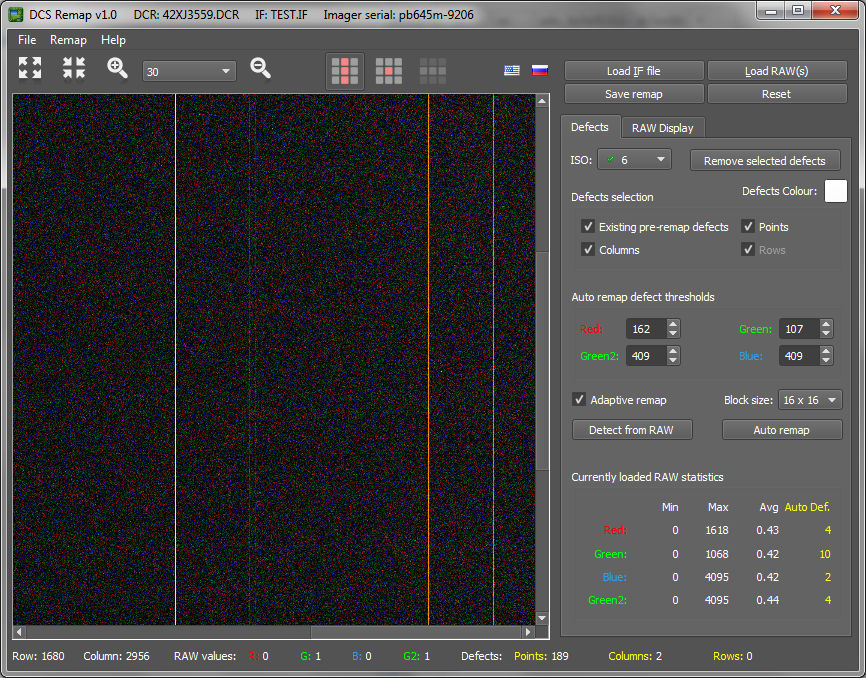
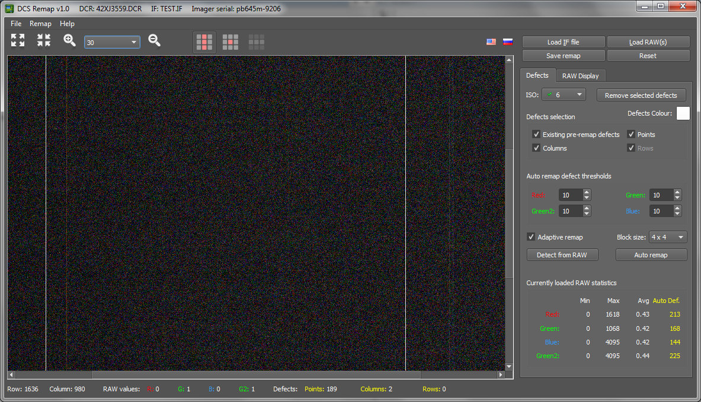
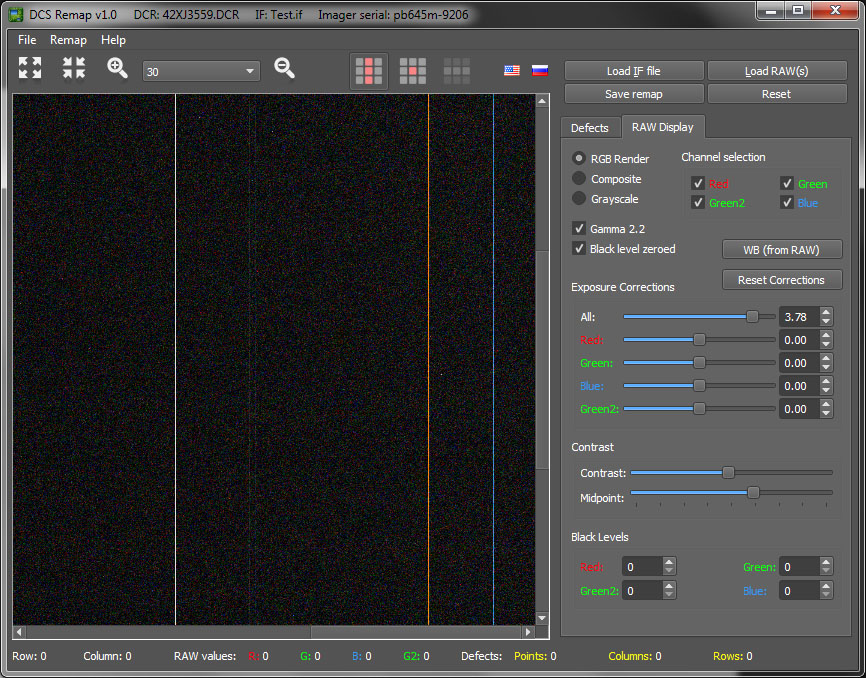

# DCS Remap

This software allows to perform defective pixels, rows and columns remap for Kodak DCS cameras. Currently supported camera models are Kodak DCS Proback 645 M/C/H, Kodak DCS 14n, 14nx, SLR/n and SLR/c. Out of all the cameras extensive tests were done on various Probacks and 14nx and SLR/n models, the rest should work but not extensively tested.

## Building from sources
The build system has been ported to CMake so it should be easier to build. The usage of OMP has also been replaced with open source Thread Building Blocks (TBB) library. The dependencies for this project are (with minimum versions - those were tested):
* QT v5.15
* LibRaw v0.20.2
* Intel TBB v2021.1

Once those are installed/compiled build procedure is pretty standard for CMake project.

Set environment variable CMAKE_PREFIX_PATH to point to QT, LibRaw and TBB.

In the DCSRemap root directory run the following in command line:
```
mkdir build
cd build
cmake ..
cmake --build .
```
For MS Visual Studio/C++ the last build step is slightly different as it needs to specify the config type:
```
cmake --build --config Release .
```

After the build succeeded the complete executable (or application bundle for Mac OS) with all dependencies will be in the build directory (build/Release for MS Visual C++). For MS VC++ the runtime redistributable may be needed on target platform (downloadable from Microsoft).

Alternatively all can be build with CMake tools in VS.Code by opening this folder as a project (and setting up CMAKE_PREFIX_PATH as above).

## First a few concepts

In Kodak cameras the sensor circuitry (here and further on referred to as imager) has a special individual file that describes individual characteristics of that imager. That file is written and stored inside an internal camera memory pretty much the same as firmware but in separate non user accessible area. It is not available openly to access from standard firmware and user-level menus. All the cameras have however a special firmware mode (called service mode from now on) where it can be accessed and modified via menus. This service mode can be entered in a variety of ways (entering the special key in DCS Camera Manager that is dependent on camera serial number and so on). This software however comes with a special versions of firmware for each camera model that enables that service mode permanently so it can be just uploaded for the purpose of remap and then rolled back and replaced with standard firmware again. The following service firmwares are bundled with the application in firmware directory:

* Kodak Proback 645 M/C/H - this is no longer needed if you use any of my custom ProBack 645 firmwares from this project. All of them have service mode enabiling menu.
* Kodak 14n/14nx (enables service mode and service menu on Hotkey press)
* Kodak SLR/n (enables service mode and service menu on Hotkey press)
* Kodak SLR/c (enables service mode and service menu on Hotkey press)

The imager file contains the information about sensor defects (points, columns and rows) and needs to be downloaded from the camera for the remap, then updated with new remap and written back again.

## Remap procedure for Kodak Proback 645 M/C/H:

1) Install the above service mode firmware (twice) and use "Save IF File" menu to write imager file onto a flash card. The file should be called TEST.IF
2) On Probacks generally the remap is better done on dark frames (where people can see distinct defective columns when pulling the shadows). To perform a remap a dark shot raw file is needed. I would suggest a shot at a basic ISO with the closed lens cap at around 1/2 or 1/4 second. To improve stability of a remap, several dark shots can be made - the DCS Remap software can stack up to 7 raw files in a median stack leaving only stable defects in.
3) Backup the copy of the imager file (for safety) and load imager file and raw file(s) in DCS Remap.
4) Columns remap: adjust the exposure in a raw display tab to make the defects visible, switch on the column remapping and at high magnification mark the defective columns with the mouse. I strongly recommend using Composite or Grayscale raw display modes for manual remaps.
5) Probacks do not support (need) rows remap so all rows related parts of remap in DCS Remap will be disabled.
6) Points remap: these can also be done manually but it could be more effective to use auto remap with selected thresholds (more details below in the application help).
7) Save the remap when satisfied, check the resulting TEST.IF imager file is no larger than it was and upload it via flash card into camera using "Load IF File" menu
8) Test the new remap with a few shots and when satisfied, update firmware to the last production one (twice).

## Remap procedure for Kodak 14n/14nx, SLR/n, SLR/c:

1) Install the above service mode firmware (twice) and use hotkey to get to the service menu, choose "Save IF File" menu to write imager file onto a flash card. The file should be called TEST.IF
2) The next bit is complicated. These cameras do have a loss compressed raw which can hide some defects. The DCS Remap software will be able to handle .DCR files but may not be effective eliminating all the defects. In service mode firmware fortunately, a true raw uncompressed format can be chosen - it is referred to as .RCF files. I suggest that is used for the remap if using .DCR was not effective enough. That file however comes without any corrections so already remapped defects (those already recorded in imager file) will also be visible. Unlike Proback, for SLR cameras I suggest shooting pure white frame, uniformly lit (as much as possible) and with exposure close to saturation point (raw values below 3700 roughly uniform around the frame). If using the lens, make sure it is defocused and is at f/4 or f/5.6. Multiple raw of the same type can be stacked in median stack to improve stability of the defect appearance.
3) Backup the copy of the imager file (for safety) and load imager file and raw file(s) in DCS Remap.
4) Rows/Columns remap: adjust the exposure in a raw display tab to make the defects visible, switch on the column remapping and at high magnification mark the defective columns with the mouse. I strongly recommend using Composite or Grayscale raw display modes for manual remaps.
5) Points remap: these can also be done manually but it could be more effective to use auto remap with selected thresholds (more details below in the application help). If the uniform lit frame is difficult to achieve (and especially when using .RCF uncorrected raw files), I would strongly recommend using adaptive auto remap (see below for detailed description at how it works).
6) Save the remap when satisfied, check the resulting TEST.IF imager file is no larger than it was and upload it via flash card into camera using "Load IF File" menu
7) Test the new remap with a few shots and when satisfied, update firmware to the last production one (twice).

Of course the above are only recommended procedures. You can use manual remaps with just about anything (if the defects can be clearly seen). The automatic remap of defective points however will only work if the raw shot is uniform (i.e. roughly all of the same level - all dark or all grey or all white etc.).


## The DCS Remap program features.

The program functionality and controls is divided into two functional areas: one that has to do with raw file appearance and another that has to do with remap of defects. This can be seen on the two separate tabs to the left holding all the user interface for each of those areas in separate tab.

All the menus (except help) are duplicated with buttons on the right side of the main window so I won't describe what they do here separately.

Most of the user interface elements have appropriate tooltips to make it easier to remember the functionality.

### Main window view.



#### Toolbar

Toolbar contains buttons that control zoom levels (100%, Fit to Window, Zoom in, Zoom level selection and Zoom out), manual defect mode selector buttons (columns remap, points remap and rows remap) and interface language selection buttons (English and Russian).

Fit to Window zoom level is a bit different from commonly accepted. When selected, it will pick the largest zoom (from available list in drop down) with which the raw file will fit into window. It will also  change it when resizing. The reason it is done this way is that with specifics of raw display only the selected list of zooms allow to do it effectively.

The remap mode buttons are all mutually exclusive and will switch on the appropriate remap mode when the columns, points or rows may be selected with mouse cursor and either set or reset as defective. The selected mode has to correspond to defects selection so it will be synchronised with those settings. Proback does not allow rows remap so no row remap mode or row defects selection are available.

#### Status bar

This is used to display some dynamic statistics - the row and column under mouse cursor, the R,G,B,G2 raw channel values for pixel under mouse cursor (if raw file is loaded) and the total counts of currently remapped defects for columns, points and rows. The total defects count is affected by the defects selection settings.

#### Common buttons section

#### Load IF file

Loads and displays imager file defects. If the raw file has been already loaded and does not match the imager, a message is presented allowing to choose what to do (load imager and discard the raw or cancel imager file loading).

#### Load RAW(s)

Loads and displays single of multiple raw files. If the imager file has been already loaded and does not match the raw, a message is presented allowing to choose what to do (load raw(s) and discard the imager file or cancel raw file loading). If multiple raw files are selected (up to 7), they all stacked into single raw file using median stack (to reduce noise and eliminate non stable defects).

#### Save remap

Saves the remapped defects back to imager file. This imager file is then ready to be uploaded to the camera. After successful saving the imager file is reloaded.

#### Reset

Resets all remapped defects in this session and reloads imager file. This effectively performs a roll back of all the changes to what was the last saved or loaded imager file.


### Main window (Defects page)

This page will become enabled when imager file is loaded. The full list if its settings and user interface elements is described in the following sections.



#### ISO

This drop down allow selecting the ISO for the remap. The ISOs in a drop down list for which there are already defects defined will be indicated by checkbox against them. This affects both selection of defects for display and the remap being performed. In Kodak's remapped defects recorded with specific ISO are applicable (and will be remapped by camera) when a shot is performed at that ISO or above it. As such generally applicable defects (i.e. for any ISO) should be recorded at smallest ISO (ISO 6 in Kodaks). Majority of defects in Kodak imager files are recorder against that basic ISO. The selection of the ISO follows the same logic - it displays all the defects that can be remapped at this ISO. This selection also affects the defects count displayed in status line.

#### Remove selected defects

This button will delete all the defects selected by ISO and defects selection checkboxes form imager file (even those existing there before). This may be useful to start from fresh remap.

#### Defects Colour

This button allows to pick the colours for displaying defects. The defects are always displayed on top of the raw file but this setting may come useful in different type of images (dark, light etc.) where a specific colour may be obscured by raw file.


#### Defects selection

This block of checkboxes allows to select what defects are currently displayed and being remapped. Deselecting the type of defects currently being remapped will also disable the remap mode (buttons in toolbar). The selection affects the defects  count displayed in status line. The selection of Existing pre-remap defects is needed to allow only view newly remapped defects.

#### Auto remap defect thresholds

These define per channel thresholds used for defective points auto remap. The standard auto remap is performed by comparing the pixel values from the raw file to the calculated average value for the channel and marking it as defective if selected threshold is exceeded. If adaptive remap is selected, then the raw values are compared to a median value for the channel calculated within a block of pixels of selected size and marking it as defective if threshold for that channel is exceeded. The average standard remap works good for uniform shots (dark shots from Proback remap). The adaptive remaps work best for uncorrected .RCF files or where uniform raw file cannot be produced.

#### Adaptive remap

Enables adaptive auto remap. Selecting this enables block size drop down for adaptive remap as well. Adaptive remap will look at the image blocks of the indicated size and calculate median values for all channels for each block. The remap is then performed by comparing the raw values in the block against the medians to see if they are exceeding per-channels thresholds.

#### Block size

This drop down allows selecting the block size (in pixels) for adaptive remap. The blocks have an even size and range from 4x4 to 64x64. Larger blocks will be less localised where the bigger sample may mean more accurate median. Smaller blocks are nevertheless effective for remap of standalone pixels.

#### Detect from RAW

Selecting this button attempts to default (or re-default) thresholds from loaded raw file. It will only work for uniform  black and uniform white shots.

#### Auto remap

Pressing this button will perform standard or adaptive points auto remap according to the selected parameters.

#### Currently loaded RAW statistics

This shows statistics for loaded raw file channels - min, max and average values and the count of defects that would be auto remapped with the current settings.


### Main window (RAW Display page)

This page will become enabled when raw file(s) are loaded. The full list if its settings and user interface elements is described in the following sections.

The first group of control provides 3 options that affect how the raw file is displayed.



#### RGB Render

When selected the raw file is displayed using RGB rendering for each pixel. The missing colours are taken from neighbouring pixels in 2x2 pixel block thus making this effectively display large 2x2 pixels (each 2x2 RGBG2 block ends up being of the same colour). It is very convenient to spot colour differences in pixels but not very useful for remap - since every defect will show up as 2x2 block. For manual remap, I'd recommend to use it to spot defects and then witch to one of the other two methods to actually remap defects. Status bar in this mode shows the RGBG2 values for 2x2 block not the pixel.

#### Composite

When selected the raw file is displayed using the pixel colour only. For Red the pixel will be red, for Green/Green2 it will be green and for Blue it will be blue. With all channels selected that may make defects more difficult to spot so this is good for remapping itself not for searching for defects.

#### Grayscale

It is essentially the same as composite but each pixel has all 3 components (R, G and B) set to the underlying pixel value. It is basically a composite mode displayed in grayscale. It is a compromise between Composite and RGB Render and can be used for looking for defects as well as remapping.

#### Channel selection

These set of checkboxes allows to pick the raw channels to be displayed. The deselected channels are simply rendered black. The channels layout follow the Bayer pattern so columns and rows match those on a sensor (for easier de-selection of the even/odd rows and columns).

#### Gamma 2.2

This enables gamma 2.2 correction applied to raw data and improves the display of the raw files (and a need to apply large exposure correction).

#### Black level zeroed

This switches on a different method of applying black level. When selected the black levels are simply zeroed. I.e. each value up to selected black level in a channel is set to 0. When it is not selected, black levels calculated by traditional subtraction. This could be useful for spotting faint defective columns in dark frames for Proback and is enabled by default.

#### WB (from RAW)

This button sets all per-channel exposure boost settings to white balance multipliers extracted from raw file (if none is specified, it uses daylight ones provided by LibRaw). This is absolutely useless for remap but good to have a for playing with the raw files and analysing post remapped raw (to make them look more natural).

#### Reset Corrections

Resets all exposure, contrast and black level corrections when pressed.

#### Exposure Boost

This set of sliders and values controls exposure corrections. The values for these are indicated in stops and cover the range from -5 to +5 stops. The number values have more precision than sliders but setting the exposure with sliders is faster. The exposure correction can be done at individual channel levels and overall. These controls should be used to bring up the dark raw areas in Proback remap to a visible range and make a defects in certain channels more prominent.

#### Contrast

This section has two contrast related sliders. The Contrast slider controls level of contrast boost applied (steepness of the slope of S-curve). The Midpoint slider controls the middle point of contrast S curve. These controls should be used to make defect more prominent (and are quite useful for Proback dark frame remaps).

#### Black levels

These control set the black levels for each channel. They can be used to cut out the noise when boosting ISO on dark raw files.

#### Corrections order

All the corrections are applied to the raw data in this order: black levels -> gamma -> exposure correction -> contrast.


